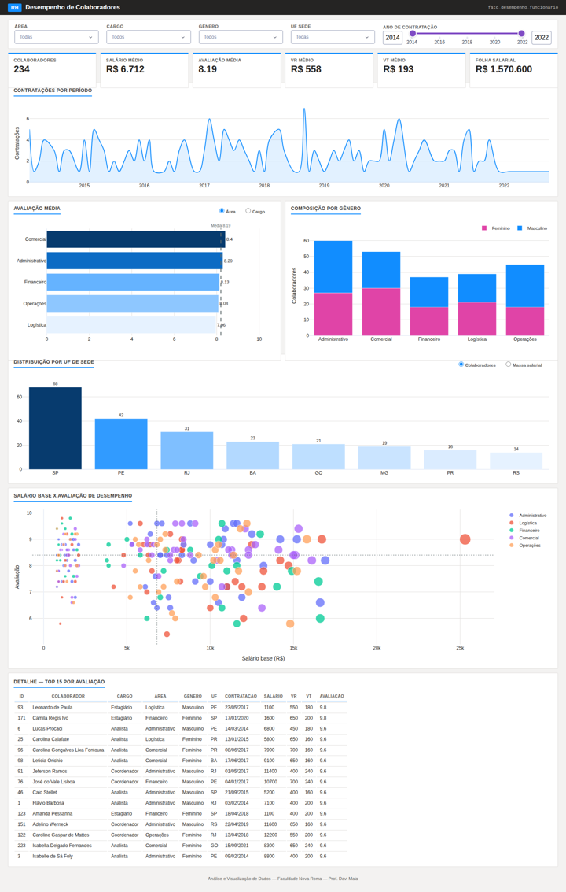

# Painel de Análise de Desempenho de Funcionários

Dashboard interativo desenvolvido em **Python (Dash + Plotly)** para análise da base de funcionários de uma empresa, com foco em desempenho, remuneração, distribuição demográfica e geográfica.

Trabalho da disciplina **Análise e Visualização de Dados** — Curso de Ciência da Computação, Faculdade Nova Roma. Professor: Davi Maia.



## Sobre o projeto

A análise é construída em torno de um modelo dimensional (Star Schema), com uma tabela fato (`fato_desempenho_funcionario`) e dimensões derivadas da base original:

- `dim_funcionario` — identificação e dados pessoais
- `dim_tempo` — data, ano e mês de contratação
- `dim_cargo_area` — cargo e área de atuação
- `dim_localidade` — cidade e estado da sede
- `dim_genero` — gênero do colaborador

O objetivo é responder, por meio de gráficos, às seguintes perguntas de negócio:

| Pergunta | Visualização |
|---|---|
| Quando? | Evolução das contratações ao longo do tempo |
| O quê? | Avaliação média por área ou cargo |
| Como? | Composição de gênero por área |
| Onde? | Distribuição de colaboradores e massa salarial por estado |
| Quanto? | Correlação entre salário base e avaliação de desempenho |

## Como executar

### Pré-requisitos
- Python 3.10 ou superior
- pip

### Passo a passo

1. Clone o repositório:
```bash
git clone https://github.com/miguelofc/dashboard-rh-funcionarios.git
cd dashboard-rh-funcionarios
```

2. (Opcional, recomendado) Crie um ambiente virtual:
```bash
python3 -m venv venv
source venv/bin/activate   # macOS/Linux
venv\Scripts\activate       # Windows
```

3. Instale as dependências:
```bash
pip install -r requirements.txt
```

4. Execute o dashboard:
```bash
python3 app.py
```

5. Acesse no navegador:
```
http://localhost:8050
```

## Estrutura do projeto

```
dashboard-rh-funcionarios/
├── app.py                  # aplicação Dash (ETL + layout + callbacks)
├── BaseFuncionarios.xlsx    # base de dados original
├── requirements.txt         # dependências do projeto
├── assets/
│   └── style.css            # estilos do painel
└── docs/
    └── preview.png           # captura de tela do painel
```

## Funcionalidades

- Filtros interativos por área, cargo, gênero, estado da sede e ano de contratação
- KPIs: total de colaboradores, salário médio, avaliação média, VR médio, VT médio e folha salarial total
- Gráfico de evolução de contratações por período
- Gráfico de avaliação média por área/cargo, com linha de referência da média geral
- Gráfico de composição de gênero por área
- Gráfico de distribuição geográfica (quantidade de colaboradores ou massa salarial por UF)
- Gráfico de dispersão correlacionando salário base e avaliação de desempenho
- Tabela analítica com os 15 colaboradores de melhor avaliação, considerando os filtros aplicados

## Autores

Luan Kato, João Vitor Guimarães, Miguel Ângelo, Gabriel Cordeiro, Gabriel Sales
